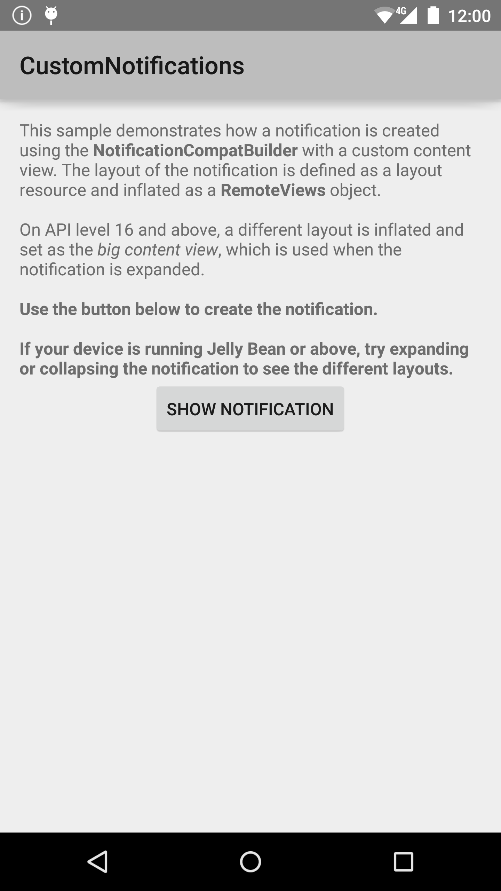
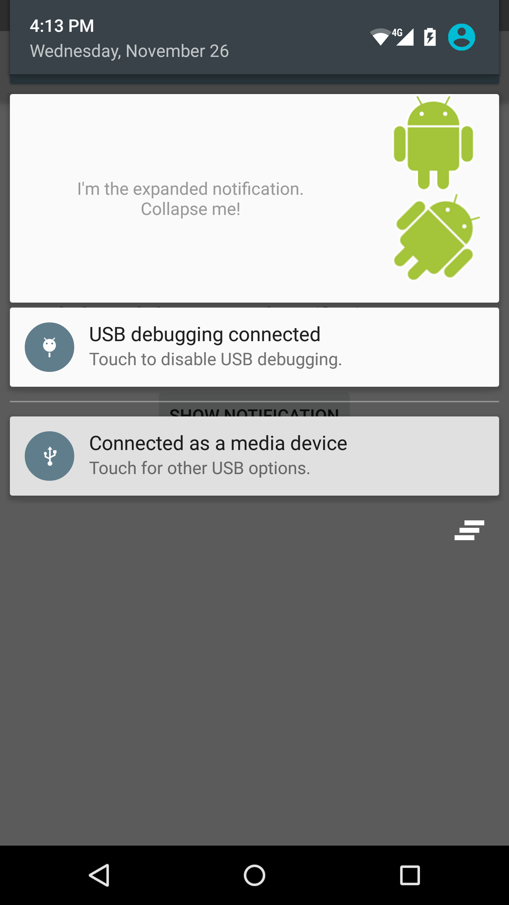

Android CustomNotifications Sample
===================================

This sample demonstrates notifications with custom content views.
The use of collapsed and expanded notification views are shown.

Introduction
------------

This sample demonstrates notifications with custom content views. It
also demonstrates the expanded notification introduced in API level 16.

This sample shows all the required steps to create and display custom
notifications:

- Create Intent to launch Activity when notification is clicked.
- Define custom layouts for collapsed and expanded views.
- Use NotificationManager's notify to show notification.

In the sample, click on the "SHOW NOTIFICATION" button to create
a notification. Use two-fingered gestures up and down to collapse
and expand the notification.

Pre-requisites
--------------

- Android SDK v23
- Android Build Tools v23.0.0
- Android Support Repository

Screenshots
-------------

  

Getting Started
---------------

This sample uses the Gradle build system. To build this project, use the
"gradlew build" command or use "Import Project" in Android Studio.

Support
-------

- Google+ Community: https://plus.google.com/communities/105153134372062985968
- Stack Overflow: http://stackoverflow.com/questions/tagged/android

If you've found an error in this sample, please file an issue:
https://github.com/googlesamples/android-CustomNotifications

Patches are encouraged, and may be submitted by forking this project and
submitting a pull request through GitHub. Please see CONTRIBUTING.md for more details.

License
-------

Copyright 2014 The Android Open Source Project, Inc.

Licensed to the Apache Software Foundation (ASF) under one or more contributor
license agreements.  See the NOTICE file distributed with this work for
additional information regarding copyright ownership.  The ASF licenses this
file to you under the Apache License, Version 2.0 (the "License"); you may not
use this file except in compliance with the License.  You may obtain a copy of
the License at

http://www.apache.org/licenses/LICENSE-2.0

Unless required by applicable law or agreed to in writing, software
distributed under the License is distributed on an "AS IS" BASIS, WITHOUT
WARRANTIES OR CONDITIONS OF ANY KIND, either express or implied.  See the
License for the specific language governing permissions and limitations under
the License.
